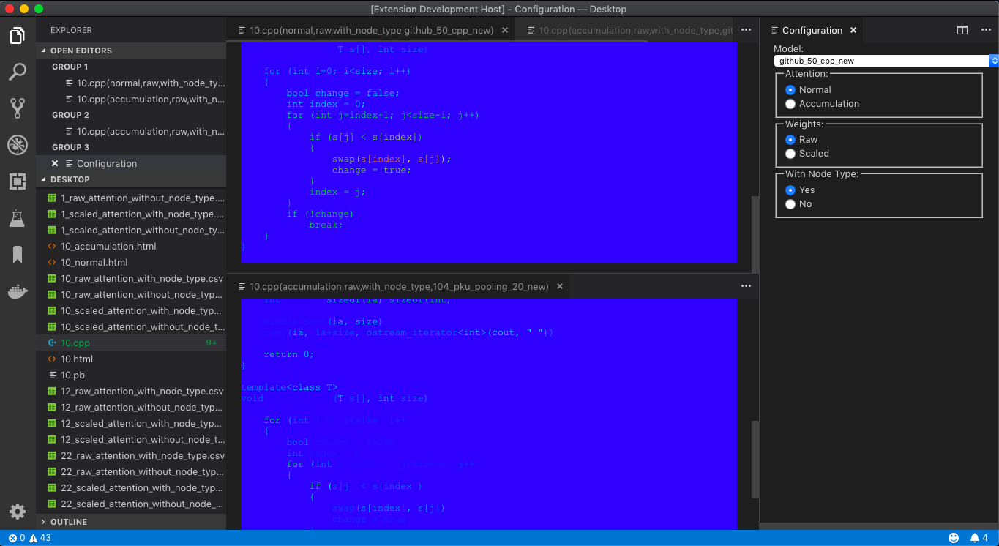
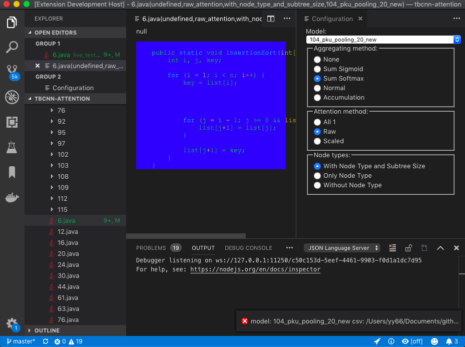

# vscode-fast
Visual Studio Code extension for flat AST


## Installation
Before using the extension, you also need to prepare the following commands to get docker image of `fast` installed:
```bash
docker pull yijun/fast
cp scripts/fast ~/bin/fast
```

## Usage
1. Open a C++ or Java program in the editor, which annotates the tokens of the program with wavy underlines;
2. The "PROGRAM" diagnostic window lists the AST nodes with information about their type, lineno, column number, etc.;
3. Click at an AST node item in the diagnostic window, it selects the corresponding code in the editor;
4. Enter "bigCoding" command by ⌘ + P, >, Big Coding, it opens a configuration view as a form to change how attention scores are computed;

   1. The `Model` drop down list presents all the pretrained models for computing the attention scores for the AST nodes;
   2. The `Attnention=accumulation` option suggests that the attention score will be accumulated when traversing the tree from top;
   3. The `Weight=raw` option suggests that the attention score will be used as is, while `Weight=scaled` option suggests that the attention score will be scaled up to maximum=1;
   4. The `With Node Type = Yes` option suggests that the nodes of the same type will have the same aggregated attention scores, while the `With Node Type = No` option suggests that the attention scores will be treated independently from other nodes of the same type;
5. Make a change to the configuration form, it opens a coloured view of the program. 

   The token colors follow the hue, saturation, and brightness (HSB) spectrum, with full saturation=1 and brightness=1. The hue is a colour analogous to the hotness, where blue = 0 to red = 1, and any colour in-between is determined by the attention score. 
