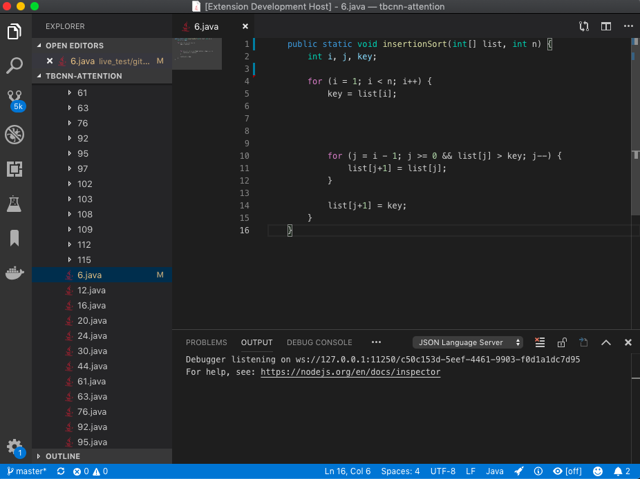
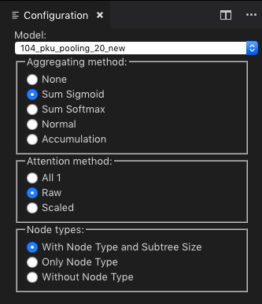

# vscode-fast
Visual Studio Code extension for flat AST


## Installation
Before using the extension, you also need to prepare the following commands to get docker image of `fast` installed:
```bash
docker pull yijun/fast
cp scripts/fast ~/bin/fast
```

## Usage
1. Add the folder to your code repository where the models have been trained, for example,



https://github.com/bdqnghi/tbcnn-attention

2. Open a C++ or Java program in the editor, which annotates the tokens of the program with wavy underlines;
3. The "PROGRAM" diagnostic window lists the AST nodes with information about their type, lineno, column number, etc.;
4. Click at an AST node item in the diagnostic window, it selects the corresponding code in the editor;
5. Enter "bigCoding" command by ⌘ + P, >, Big Coding, it opens a configuration view as a form to change how attention scores are computed;

Note. You can assign a key binding to this command by Code > Preferences > Keyboard Shortcuts
or by adding the following to your `keybindings.json` file:
```
[
    {
        "key": "ctrl+b ctrl+c",
        "command": "bigCoding.start"
    }
]
```



   1. The `Model` drop down list presents all the pretrained models for computing the attention scores for the AST nodes;
   2. The `Aggregation method` option suggests how attention scores will be aggregated while traversing from the top of AST;
   3. The `Attention method` option suggests how the attention scores will be used as all 1, as raw scores, or scaled up to 1;
   4. The `Node Types` option suggests that the attention scores will consider both node type and tree size, only the node types or without node types;
6. Any change to the configuration form opens a coloured view of the program. 


   The token colors follow the hue, saturation, and brightness (HSB) spectrum, with full saturation=1 and brightness=1. The hue is a colour analogous to the hotness, where blue = 0 to red = 1, and any colour in-between is determined by the attention score. 
